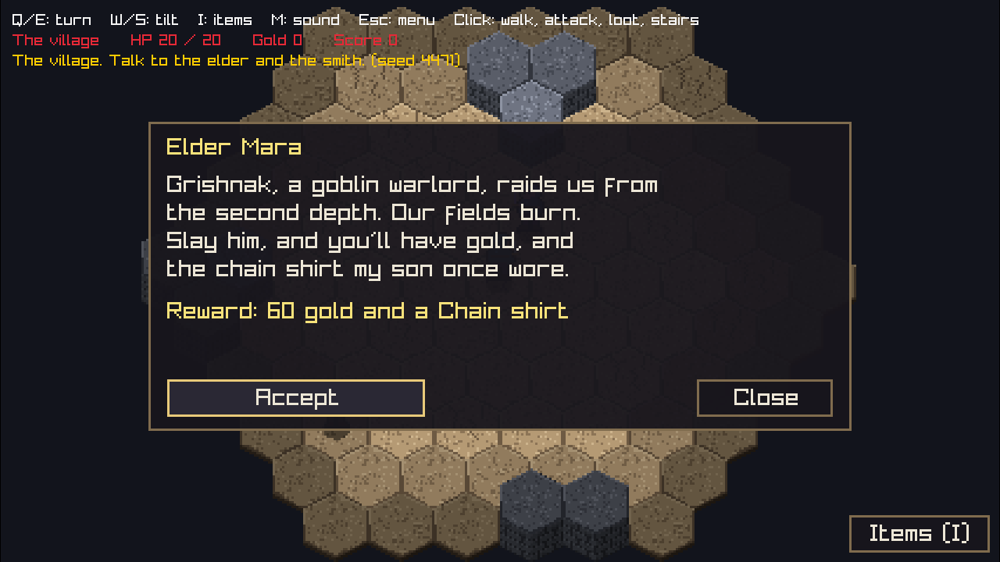

# Hex dungeon

A prototype roguelike on a hex grid: pixel-art tiles and sprites drawn as 3D
meshes and billboards, seen through an orthographic camera, rendered at
640x360 and scaled up so every pixel stays square.



## What's in it

- **Hex grid** in axial coordinates, with pathfinding, line of sight and
  mouse picking (`hexgrid/hexgrid.odin`)
- **Cave levels** generated from a seed, with tile variants, stairs, and
  levels that stay as you left them when you walk back up
- **Creatures** with six-direction sprite sheets, walk, attack, hurt and death
  animations, including a three-hex ogre
- **Items**: inventory, equipment, loot, corpses, chests, dropping
- **A village** (depth 0) with villagers, quests and named creatures
- **Saving** to three slots, a ranking list, and sound effects

## Building

Install [Odin](https://odin-lang.org/) (a recent release; raylib ships with
it), then from this folder:

```
odin run .          # play
odin test .         # run the tests
```

All art and sound is built into the executable, so the game can be started
from any folder. `saves/` is created next to the program.

## Controls

| | |
|---|---|
| Click | walk, attack, loot, talk, take stairs |
| Right-click (in inventory) | drop an item (Shift: the whole stack) |
| Q / E | turn the camera 60 degrees |
| W / S | tilt the camera |
| I | inventory |
| M | sound on/off |
| Esc | menu / close a panel |

## Editing content

- `assets/content.json` holds the creatures, villagers, quests and named
  creatures: names, dialogue, rewards, stats, and what each monster does on its
  turn. The game reads this file if it sits next to the program, otherwise the
  copy built into it, so you can edit and restart without recompiling.
- **Behaviours**: each creature lists behaviours in priority order, e.g. the
  goblin has `Flee_When_Hurt`, `Melee_Attack`, `Chase_Player`, `Wander`. On its
  turn each is tried in order until one acts, so changing how a monster fights
  is a data change. The capabilities themselves live in `behaviour.odin`;
  adding a new one there makes it available to every creature.
- `art_source/*.py` regenerate the images and sounds in `assets/` (needs Python
  with numpy, scipy and Pillow).
- `sounds_guide.png`, `atlas_layout_guide.png`, `sprite_sheet_guide.png` and
  `items_and_objects_guide.png` show how each asset file is laid out.

## Pixel-art rendering and creature sprites

The game renders to a **640×360** internal image (16:9) and presents it with
nearest-neighbor filtering. It chooses the largest integer scale that fits the
window and letterboxes any remaining space: 1280×720 is 2×, 1920×1080 is 3×,
and 2560×1440 is 4×. A smaller window may use 1× rather than blur the image.
World and hex geometry are still measured in art/world units and do not change
when a creature's canvas changes.

Creature sprite metadata lives beside creature data in `assets/content.json`:

- `frame_size` is the default canvas size. Ordinary new humanoid art should
  generally be around 32×32, but this is an art guideline, not an engine limit.
  Small creatures, large creatures, and bosses can use any canvas size.
- `sprite_anchor` is `[x, y]` from the canvas's upper-left. It is the feet/ground
  point placed on the creature's logical hex; transparent padding, ears, weapons,
  and tall poses can extend outside that hex.
- `sprite_columns` maps the six direction slots to columns. Direction order is
  `East, North_East, North_West, West, South_West, South_East` (the same order as
  `hexgrid.Direction`).
- Each `animations` entry selects `Idle`, `Walk`, `Attack`, `Hurt`, or `Death`,
  with `fps`, `loop`, and either `frame_rows` for a regular grid or six explicit
  `directions` lists. An explicit frame is `{"source": [x, y, width, height]}`;
  this supports irregular atlas packing and frame sizes without gameplay changes.

The adventurer and goblin use the validated contract in
`assets/sprite_contract.json`: six direction columns by nine 32×32 animation
rows. Their metadata supplies a two-frame idle, four-beat walk, two-frame
attack, recoil, and two-frame death. Other creatures may retain the legacy
layout when this metadata is absent. Source generators in `art_source/` remain
the source-art-to-generated-asset workflow.

The ogre demonstrates that this is not a one-size-only contract: its separate
`assets/ogre_sprite_contract.json` defines six 40×48 direction cells by nine
animation rows while retaining its larger three-hex footprint.

## Status and honest caveats

This is a **prototype**, built as a base for further iterations, not a
finished game and not a reference for how to write Odin.

- The code and all placeholder art and sound were generated with AI assistance
  (Claude) and have **not been reviewed** line by line. File organisation and
  idioms may not match what an experienced Odin programmer would write.
- The sound effects are synthesized placeholders and, frankly, not good ones.
  They are easy to replace: drop new WAV files into `assets/sounds/`.
- Save files break between versions on purpose; the game shows older saves as
  unreadable rather than loading them wrong.

## License

MIT, see `LICENSE`. Third-party components are listed in `THIRD_PARTY.md`.